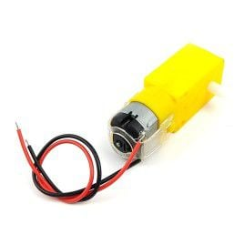

# ESP32 Hybrid Car – Wi-Fi + MQTT + Bluetooth + Battery Monitor

This project is a smart remote-controlled car using **ESP32**, supporting hybrid communication via both **Wi-Fi (MQTT)** and **Bluetooth**.  
It enables remote operation, obstacle detection using an ultrasonic sensor, battery monitoring,  
an **OLED Display**, and an **Emergency Stop** system for safety.

---

## Hybrid Communication
- Connects to Wi-Fi for communication via MQTT  
- Supports Bluetooth and can work alongside Wi-Fi (hybrid mode)  
- Automatically reconnects to Wi-Fi and MQTT if the connection is lost  

---

## MQTT Control
- Receives commands via MQTT Topic: `car/cmd`  
- Sends ACK / status via MQTT Topic: `car/response`  
- Uses a unique MQTT client ID generated from ESP32's MAC address  
- Includes **Exponential Backoff** for stable MQTT reconnections  

---

## Motor Control
- All-wheel drive with PWM controlled DC motors  
- Direction commands:  
  - `w` = Forward  
  - `s` = Backward  
  - `a` = Turn Left  
  - `d` = Turn Right  
  - `x` = Stop  
- Speed control via numeric values (`0–255`)  
- “Steering” is handled by stopping front wheels (no servo)  
- Emergency Stop supported via an interrupt button: `i`  

---

## Sensors & Detection
- **Ultrasonic Sensor**: Detects obstacles  
  - Automatically stops motors when objects are too close  
- **Battery Monitor**:  
  - Reads battery voltage via ADC  
  - Displays percentage and voltage on OLED  
  - Low battery alert when below 20%  

---

## OLED Display
- Shows car status, distance (ultrasonic), speed, emergency state, and battery level  

---

## Safety & Stability
- Monitors Free Heap Memory and automatically restarts ESP32 if memory is too low  
- Interrupt button allows for immediate Emergency Stop or toggle of emergency state  

---

## Software Structure
- **FreeRTOS Tasks**  
  - `commsTask`: Manages Wi-Fi, MQTT, and Bluetooth  
  - `sensorsTask`: Reads ultrasonic and battery sensors  
  - `controlTask`: Processes commands and controls motors  
- Uses **Semaphore / Mutex** for safe shared data access  
- Avoids dynamic `String` objects to prevent memory fragmentation  

---

## platformio.ini Setup
```ini
[env:esp32doit-devkit-v1]
platform = espressif32
board = esp32doit-devkit-v1
framework = arduino
board_build.partitions = min_spiffs.csv
monitor_port = COM3
monitor_speed = 115200
upload_speed = 115200
lib_deps =
    adafruit/Adafruit SSD1306@^2.5.15
    arduinogetstarted/ezButton@^1.0.6
    knolleary/PubSubClient
    madhephaestus/ESP32Servo@^1.1.0
```

---

## Installation
- Install [Mosquitto MQTT Broker](https://mosquitto.org/download/)  
- Install Python dependencies:

```bash
pip install paho-mqtt pyserial keyboard
```

---

## Usage
- Edit Wi-Fi SSID and Password in the STA configuration section of the ESP32 code  
- Set the broker IP address to match the machine running Mosquitto (default port: 1883)  
- Start the Mosquitto MQTT broker  
- Upload the main ESP32 code (`esp32.cpp`)  
- Open `Controller.py`:  
  - Set the IP address of the MQTT broker machine  
  - Run the script to control via keyboard (Wi-Fi / MQTT mode)  
  - Or select Bluetooth serial port to control via Bluetooth  

---

## Equipment

### 4 Wheels MiniCar Kit


### ESP32-WROOM32 With WiFi and Bluetooth


### 3.7V 18650 Rechargable Li-oin Batteries


### LM2596S DC-DC Buck Conventer


### DC Motor 6V 1:48


### L298N Driver Board


### OLED Display 128 x 64


### Ultrasonic Sensor HC-SR04


## Block Diagram


## Circuit Diagram
<<<<<<< HEAD

=======

>>>>>>> c6f35cf5d0dd22ff7d76a371ed5a9208515792dd

## Car Versions

### Remote Mini Car First Version - Connects Motors with Batteries


### Remote Mini Car Second Version - Connects L298N Driver Boards with Motors


### Remote Mini Car Third Version - Connects L2598N Driver Boards with ESP32-WROOM32


### Remote Mini Car Final Version - Add L2596 DC-DC Buck Conventer between 2x 3.7V 18650 Batteries and ESP32-WROOM32


