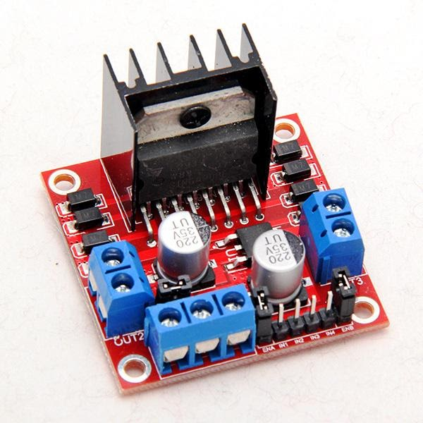
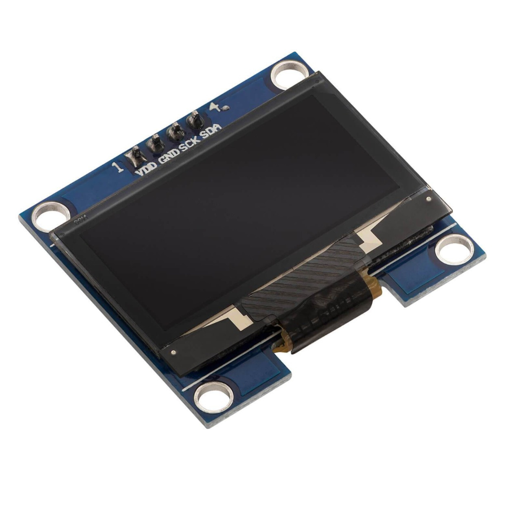
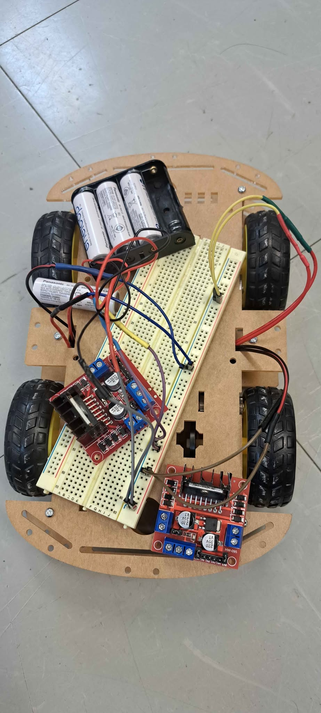

ESP32 Hybrid Car – Wi-Fi + MQTT + Bluetooth + Battery Monitor
โปรเจคนี้คือรถควบคุมอัจฉริยะที่ใช้ **ESP32** เชื่อมต่อทั้ง **Wi-Fi (MQTT)** และ **Bluetooth**  
รองรับการสั่งงานระยะไกล, ตรวจจับสิ่งกีดขวางด้วย Ultrasonic, ตรวจวัดสภาพแวดล้อมด้วย DHT11,  
และมีระบบ Battery Monitor + OLED Display พร้อม Emergency Stop เพื่อความปลอดภัย  

## Hybrid Communication
- เชื่อมต่อกับเครือข่าย Wi-Fi สำหรับสื่อสารผ่าน MQTT
- รองรับ Bluetooth และสามารถใช้ควบคู่ไปด้วยกันกับ WiFi (Hybride)
- Reconnect Wifi และ Reconnect MQTT ถ้าหากการเชื่อมต่อขาดหาย

## MQTT Control
- รับคำสั่งผ่าน MQTT Topic car/cmd
- ส่ง ACK / status ผ่าน MQTT Topic car/response
- ใช้ client ID เฉพาะ ของ ESP32 จาก MAC address
- มีระบบ Exponential Backoff สำหรับการเชื่อมต่อ MQTT 

## การควบคุมมอเตอร์
- มีมอเตอร์ทุกล้อ ควบคุมด้วย PWM ขับเคลื่อนสี่ล้อ
- สามารถสั่งให้รถ เดินหน้า, ถอยหลัง, เลี้ยวซ้าย/ขวา, หยุด (w Forward,s Backward,a Left,d Right,x Stop)
- ตั้งความเร็วโดยใส่ค่าตัวเลข (0-255)
- มีการควบคุม "เลี้ยว" โดยหยุดล้อหน้า-ซ้าย/ขวา (ไม่ใช้ Servo)
- รองรับ Emergency Stop ผ่านปุ่ม Interrupt (i Interrupt)

## เซ็นเซอร์และการตรวจจับ
- DHT11 สำหรับวัดอุณหภูมิและความชื้น
- Ultrasonic Sensor สำหรับตรวจจับสิ่งกีดขวาง
   - หยุดมอเตอร์อัตโนมัติเมื่อพบสิ่งกีดขวางใกล้เกินที่กำหนด (Obstacle)
- Battery Monitor
   - อ่านแรงดันแบตเตอรี่ผ่าน ADC
   - แสดง % และ Voltage บน OLED
   - แจ้งเตือนเมื่อแบตเตอรี่ต่ำกว่า 20 %
 
## OLED Display
- แสดงสถานะรถ, อุณหภูมิ, ความชื้น, ระยะเซ็นเซอร์, ความเร็ว, Emergency และแบตเตอรี่

## ความปลอดภัยและความเสถียร
- ตรวจสอบ Free Heap Memory และรีสตาร์ท ESP32 อัตโนมัติเมื่อ Heap ต่ำเกินไป
- ปุ่ม Interrupt สามารถ หยุดฉุกเฉิน และสลับสถานะ Emergency ได้ทันที

## โครงสร้างซอฟต์แวร์
- FreeRTOS Tasks:
   -  commsTask : จัดการ Wi-Fi, MQTT และ Bluetooth
   -  sensorsTask : อ่านเซ็นเซอร์ DHT, Ultrasonic, Battery
   -  controlTask : ประมวลผลคำสั่งและควบคุมมอเตอร์
- ใช้ Semaphore,Mutex สำหรับป้องกันการเข้าถึงข้อมูลร่วมกัน
- ลดการใช้ String objects เพื่อป้องกัน Fragmentation

## platformio Setup
[env:esp32doit-devkit-v1]
platform = espressif32
board = esp32doit-devkit-v1
framework = arduino
board_build.partitions = min_spiffs.csv
monitor_port = COM3 
monitor_speed = 115200 
upload_speed = 115200
lib_deps = 
	adafruit/Adafruit SSD1306@^2.5.15
	arduinogetstarted/ezButton@^1.0.6
	adafruit/DHT sensor library
	adafruit/Adafruit Unified Sensor
	knolleary/PubSubClient
	madhephaestus/ESP32Servo@^1.1.0

## การติดตั้ง
-  https://mosquitto.org/download/
-  pip install paho-mqtt
-  pip install pyserial

## การใช้งาน
-  แก้ไขค่า Wi-Fi SSID / PASSWORD ในส่วนของ STA
-  แก้ไขค่า IP เป็นของเครื่องที่รัน MQTT Broker และตั้งค่า Port (พอร์ตเริ่มต้น: 1883)
-  หลังจากติดตั้ง Mosquitto เสร็จให้เปิดใช้งาน
-  อัปโหลดโค้ดหลักไปยัง Microcontroller esp32
-  เปิดไฟล์ pc_mqtt_control.py
   - ตั้งค่าที่อยู่ IP ของเครื่อง MQTT Broker
   - รันสคริปต์เพื่อควบคุมผ่านแป้นพิมพ์
-  เปิดไฟล์ pc_bt_control.py
   - ตั้งค่าพอร์ตอนุกรมบลูทูธ
   - รันสคริปต์เพื่อควบคุมผ่านบลูทูธโดยใช้แป้นพิมพ์
     
## อุปกรณ์

### ชุดรถบังคับ 4 ล้อ

### ESP32-WROOM32 พร้อม WiFi และ Bluetooth

### มอเตอร์กระแสตรง 6V 1:48

### บอร์ดไดรเวอร์ L298N

### จอ OLED 128 x 64

### เซนเซอร์อัลตราโซนิก HC-SR04

## บล็อกไดอะแกรม

## เวอร์ชันของรถ

### เวอร์ชันแรก – ต่อมอเตอร์เข้ากับแบตเตอรี่โดยตรง

### เวอร์ชันที่สอง – ใช้บอร์ด L298N เชื่อมกับมอเตอร์

### เวอร์ชันที่สาม – เชื่อม ESP32-WROOM32 เข้ากับ L298N และมอเตอร์

