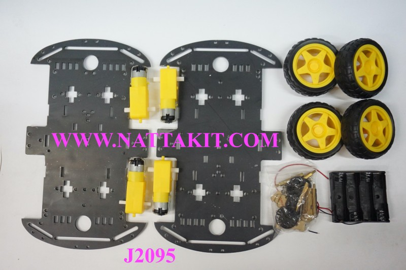
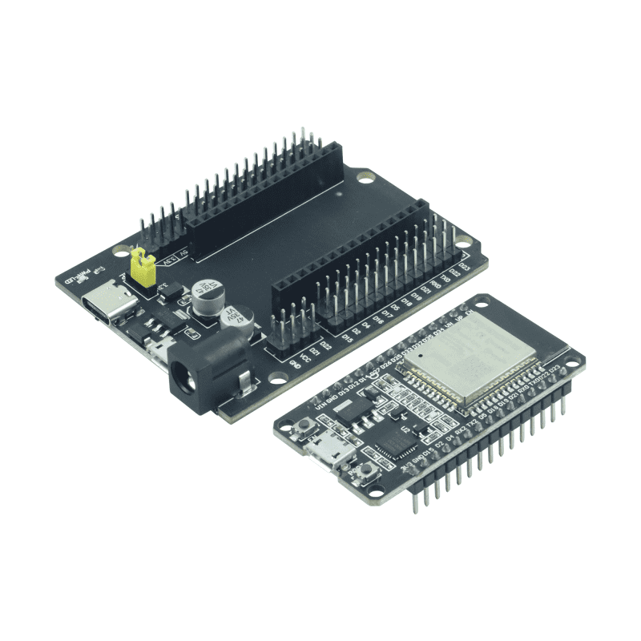
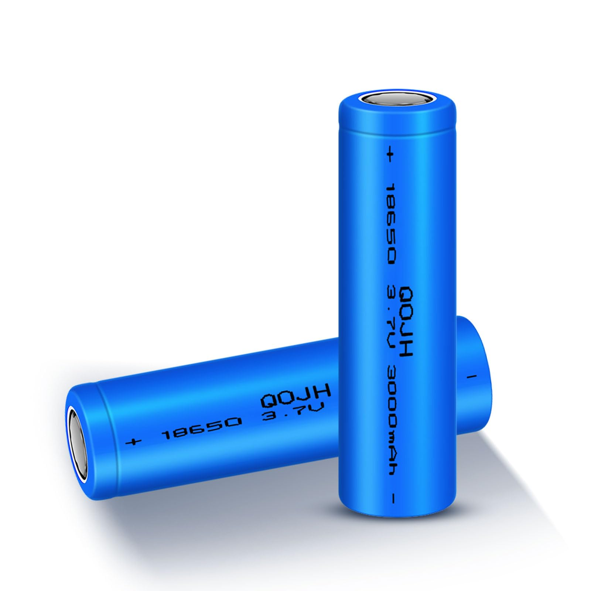
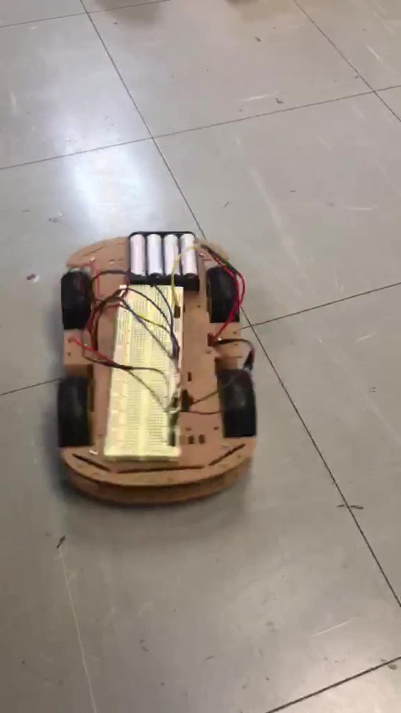
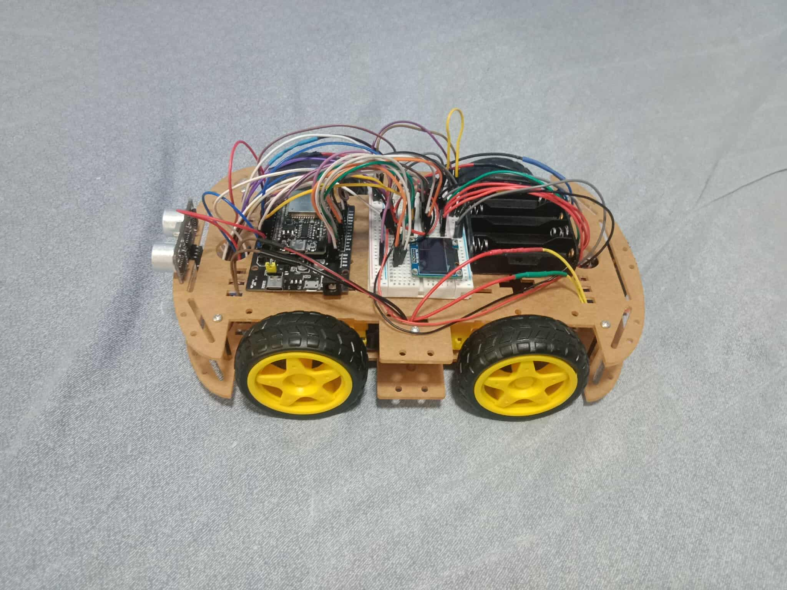
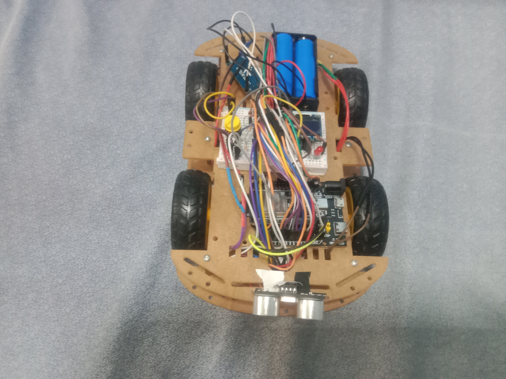

# ESP32 Hybrid Car – Wi-Fi + MQTT + Bluetooth + Battery Monitor (ภาษาไทย)

โปรเจคนี้คือรถควบคุมอัจฉริยะที่ใช้ **ESP32** เชื่อมต่อได้ทั้ง **Wi-Fi (MQTT)** และ **Bluetooth**  
รองรับการสั่งงานระยะไกล, ตรวจจับสิ่งกีดขวางด้วย Ultrasonic, ตรวจสอบแบตเตอรี่,  
พร้อม **OLED Display** และระบบ **Emergency Stop** เพื่อความปลอดภัย  

---

## การสื่อสาร Hybrid
- เชื่อมต่อกับเครือข่าย Wi-Fi สำหรับสื่อสารผ่าน MQTT  
- รองรับ Bluetooth และสามารถใช้ควบคู่ไปด้วยกัน (Hybrid mode)  
- Reconnect Wi-Fi และ MQTT อัตโนมัติหากการเชื่อมต่อขาดหาย  

---

## การควบคุมผ่าน MQTT
- รับคำสั่งผ่าน MQTT Topic: `car/cmd`  
- ส่ง ACK / status ผ่าน MQTT Topic: `car/response`  
- ใช้ client ID เฉพาะของ ESP32 จาก MAC address  
- มีระบบ **Exponential Backoff** สำหรับการ reconnect ที่เสถียร  

---

## การควบคุมมอเตอร์
- ขับเคลื่อน 4 ล้อ ควบคุมด้วย PWM  
- คำสั่งทิศทาง:  
  - `w` = เดินหน้า  
  - `s` = ถอยหลัง  
  - `a` = เลี้ยวซ้าย  
  - `d` = เลี้ยวขวา  
  - `x` = หยุด  
- ตั้งค่าความเร็วด้วยตัวเลข (`0–255`)  
- เลี้ยวโดยหยุดล้อหน้า (ไม่มี Servo)  
- Emergency Stop ผ่านปุ่ม interrupt: `i`  

---

## เซ็นเซอร์และการตรวจจับ
- **Ultrasonic Sensor** สำหรับตรวจจับสิ่งกีดขวาง  
  - หยุดมอเตอร์อัตโนมัติเมื่อใกล้เกินไป  
- **Battery Monitor**  
  - อ่านแรงดันแบตเตอรี่ด้วย ADC  
  - แสดง % และแรงดันบน OLED  
  - แจ้งเตือนแบตต่ำกว่า 20%  

---

## OLED Display
- แสดงสถานะรถ, ระยะ Ultrasonic, ความเร็ว, สถานะ Emergency และแบตเตอรี่  

---

## ความปลอดภัยและความเสถียร
- ตรวจสอบ Free Heap Memory และรีสตาร์ทอัตโนมัติเมื่อหน่วยความจำต่ำ  
- ปุ่ม Emergency ใช้หยุดฉุกเฉินหรือสลับสถานะ Emergency ได้ทันที  

---

## โครงสร้างซอฟต์แวร์
- **FreeRTOS Tasks**  
  - `commsTask` : จัดการ Wi-Fi, MQTT และ Bluetooth  
  - `sensorsTask` : อ่าน Ultrasonic และ Battery  
  - `controlTask` : ประมวลผลคำสั่งและควบคุมมอเตอร์  
- ใช้ **Semaphore / Mutex** เพื่อป้องกันการชนกันของข้อมูล  
- ลดการใช้ `String` เพื่อป้องกัน Fragmentation  

---

## platformio.ini Setup
```ini
[env:esp32doit-devkit-v1]
platform = espressif32
board = esp32doit-devkit-v1
framework = arduino
board_build.partitions = min_spiffs.csv
monitor_port = COM3
monitor_speed = 115200
upload_speed = 115200
lib_deps =
    adafruit/Adafruit SSD1306@^2.5.15
    arduinogetstarted/ezButton@^1.0.6
    knolleary/PubSubClient
    madhephaestus/ESP32Servo@^1.1.0
```

---

## การติดตั้ง
- ติดตั้ง [Mosquitto MQTT Broker](https://mosquitto.org/download/)  
- ติดตั้ง dependencies ของ Python:

```bash
pip install paho-mqtt pyserial keyboard
```

---

## การใช้งาน
- แก้ไข Wi-Fi SSID / PASSWORD ในโค้ด ESP32  
- กำหนด IP ของ MQTT Broker ให้ตรงกับเครื่องที่รัน Mosquitto (พอร์ตเริ่มต้น: 1883)  
- เปิดใช้งาน Mosquitto Broker  
- อัปโหลดโค้ดหลัก (`esp32.cpp`) ไปยัง ESP32  
- เปิดไฟล์ `Controller.py`:  
  - กำหนดค่า IP ของ MQTT broker  
  - รันสคริปต์เพื่อควบคุมผ่านแป้นพิมพ์ (โหมด Wi-Fi / MQTT)  
  - หรือเลือกพอร์ต Bluetooth เพื่อต่อและควบคุมผ่าน Bluetooth  

---

## อุปกรณ์

### ชุดรถบังคับ 4 ล้อ


### ESP32-WROOM32 พร้อม WiFi และ Bluetooth


### 3.7V ถ่านไลออนชาร์จ 18650 


### LM2596S บั๊คแปลงไฟกระแสตรง


### มอเตอร์กระแสตรง 6V 1:48


### บอร์ดไดรเวอร์ L298N


### จอ OLED 128 x 64


### เซนเซอร์อัลตราโซนิก HC-SR04


## บล็อกไดอะแกรม


## ไดอะแกรมวงจร


## เวอร์ชันของรถ

### เวอร์ชันแรก – ต่อมอเตอร์เข้ากับแบตเตอรี่โดยตรง


### เวอร์ชันที่สอง – ใช้บอร์ด L298N เชื่อมกับมอเตอร์


### เวอร์ชันที่สาม – เชื่อม ESP32-WROOM32 เข้ากับ L298N และมอเตอร์


### เวอร์ชันสุดท้าย - เชื่อม L2596 DC-DC Buck Conventer ระหว่าง 2x 3.7V 18650 Batteries กับ ESP32-WROOM32





